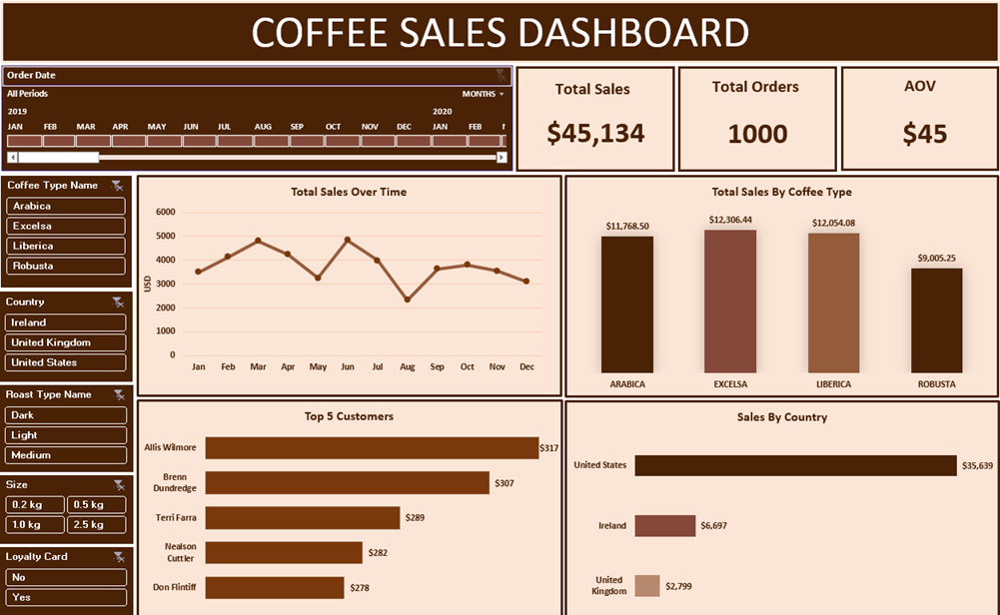

# Coffee Sales Dashboard

Analyzing coffee sales, customer performance, product performance, and market trends using **Microsoft Excel** and an interactive dashboard.

---

## Table of Contents

- [Overview](#overview)
- [Business Problem](#business-problem)
- [Dataset](#dataset)
- [Tools & Technologies](#tools--technologies)
- [Project Structure](#project-structure)
- [Data Preparation & Transformation](#data-preparation--transformation)
- [Data Analysis](#data-analysis)
- [Excel Dashboard](#excel-dashboard)
- [Key Findings](#key-findings)
- [Project Report](#project-report)
- [Project Presentation](#project-presentation)
- [Author & Contact](#author--contact)

---

## Overview

This project analyzes coffee sales data to understand overall sales performance, product contribution, customer purchasing patterns, and country-wise sales.

The analysis was performed using Microsoft Excel, starting with data preparation and integration, followed by sales calculations, Pivot Table analysis, and the development of an interactive dashboard.

---

## Business Problem

Coffee businesses need to understand which products, markets, and customers contribute most to their sales.

This project aims to:

- Analyze overall coffee sales performance
- Identify the best-performing coffee types
- Compare sales across countries
- Identify top customers
- Analyze sales trends over time
- Provide an interactive dashboard for exploring sales performance

---

## Dataset

The project uses **three related datasets**:

### Orders

Contains transaction-level information including:

- Order ID
- Order Date
- Customer ID
- Product ID
- Quantity

### Customers

Contains customer information including:

- Customer ID
- Customer Name
- Email
- Country
- Loyalty Card

### Products

Contains product information including:

- Product ID
- Coffee Type
- Roast Type
- Size
- Unit Price
- Profit

The three datasets were connected using Customer ID and Product ID to create a complete dataset for analysis.

---

## Tools & Technologies

- Microsoft Excel
- XLOOKUP / Lookup Functions
- IF Function
- Pivot Tables
- Pivot Charts
- Slicers
- Timeline
- Excel Dashboard

---

## Project Structure

```text
coffee_sales_dashboard/
│
├── README.md
├── coffee_orders_data.xlsx
├── coffee_sales_dashboard.xlsx
├── coffee_sales_dashboard_report.pdf
├── coffee_sales_dashboard_presentation.pdf
└── dashboard_preview.png
```

## Data Preparation & Transformation

The following steps were performed to prepare the data for analysis:

- Explored the structure of the three datasets
- Reviewed the relationships between Orders, Customers, and Products
- Used lookup functions to retrieve customer information
- Used lookup functions to retrieve product information
- Added customer details to the Orders table
- Added product details to the Orders table
- Created readable Coffee Type and Roast Type fields
- Calculated Sales using **Quantity × Unit Price**
- Applied appropriate date and currency formatting
- Prepared the final dataset for analysis

---

## Data Analysis

After preparing the data, Pivot Tables were used to summarize the information and identify important sales patterns.

The analysis focused on:

### Sales Performance

Analyzed total sales and average order value to understand overall business performance.

### Sales by Coffee Type

Compared the contribution of different coffee types to identify the best-performing products.

### Sales by Country

Analyzed sales across different countries to identify the strongest markets.

### Top Customers

Ranked customers based on their total sales contribution to identify high-value customers.

### Sales Trends

Analyzed sales over time to understand changes in sales performance.

---

## Excel Dashboard

The final dashboard provides an interactive view of coffee sales performance.

### KPI Cards

- Total Sales
- Total Orders
- Average Order Value

### Visualizations

- Monthly Sales Trend
- Sales by Coffee Type
- Sales by Country
- Top 5 Customers

### Interactive Filters

- Roast Type
- Coffee Size
- Loyalty Card
- Order Date Timeline

The filters allow users to interact with the dashboard and analyze sales from different perspectives.

### Dashboard Preview



---

## Key Findings

The analysis produced the following insights:

### Overall Performance

- Total sales were **$45,134.26**.
- The dataset contains **1,000 orders**.
- Average order value was **$45.13**.

### Coffee Type Performance

- **Excelsa** generated the highest share of sales at **27.27%**.
- **Liberica** contributed **26.71%** of total sales.
- **Arabica** contributed **26.07%**.
- **Robusta** had the lowest contribution at **19.95%**.

The sales contribution across the four coffee types was relatively balanced, although Excelsa performed slightly better than the other varieties.

### Country Performance

- The **USA** generated **78.96%** of total sales.
- **Ireland** contributed **14.84%**.
- The **United Kingdom** contributed **6.20%**.

The USA was therefore the largest market, accounting for the majority of total sales.

### Customer Performance

The dashboard also identifies the **Top 5 Customers** based on their total sales contribution. This can help the business recognize high-value customers and understand customer purchasing patterns.

---

## Business Value

The dashboard can help a business:

- Monitor overall sales performance
- Identify high-performing coffee products
- Compare sales across different markets
- Identify valuable customers
- Track sales trends over time
- Explore sales using interactive filters
- Support data-driven business decisions

---

## Project Report

[View Project Report](coffee_sales_dashboard_report.pdf)

A detailed project report describing the project objective, dataset, data preparation, analysis, dashboard development, business insights, and learning outcomes.

---

## Project Presentation

[View Project Presentation](coffee_sales_dashboard_presentation.pdf)

A short presentation summarizing the project objective, workflow, dashboard, and key business insights.

---

## Author & Contact

**Shivani Verma**

*Aspiring Data Analyst*

Email: [svshivani4444@gmail.com](mailto:svshivani4444@gmail.com)

[LinkedIn](https://www.linkedin.com/in/shivani-verma-23076629a/)

[Portfolio](https://shivani-verma.lovable.app)
